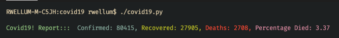

# covid19

Simple python code to get COVID19 numbers with data is pulled from:
<https://github.com/CSSEGISandData/COVID-19>

Well there's a REST API too:
<https://github.com/CSSEGISandData/COVID-19/issues/124> - but it just pulls
data from the same source I am getting this from. I think.

Data on Deaths, Confirmed cases, Recoveries and Percentage Died are calculated
by pulling the CSV files down, and creating pandas df's, summing the data up
ofthe last known column, which is also the latest.



To install:

```bash
    cd covid19 # cd to the directory
    brew install pipenv
    pipenv install
    ./covid19.py
```

To run infinitely, E.g.:

```bash
    while true; do ./covid19.py; sleep 30; done
```

Or:

```bash
    ./covid19.sh
```
